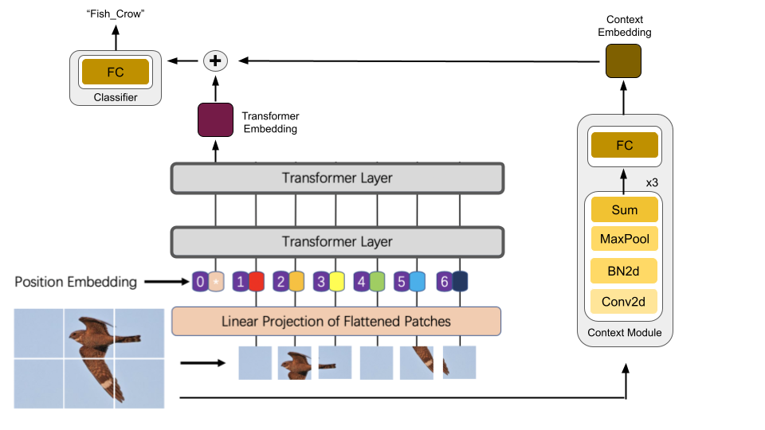

# TrasnforBirds - An attempt for Context-aware Vision Transformers

## Object Recognition and Computer Vision
### Assignment 3: Image classification 

#### Overview

Pytorch implementation of *TransforBirds - An attempt for a context aware ViT*. Model architecture below:


#### Requirements

Run the following command to install the dependencies

```bash
pip install -r requirements.txt
```

#### Dataset

Simply run 

```bash
sh build_data.sh
```

In order to automatically build the dataset (including our customly augmented dataset).

#### Training and validating your model

This code supports visualization through Wandb. If you don't want to use it, please specify it when running the main script.

You have **one** config file to edit. Please refer to the [training wiki](wiki/train.md) in order to understand each argument of the config file. After modifying the config file, run:
```bash
python main.py --file config.ini
```
Here are the results obtained on the public test set with each model:

| Parameter                 |Description   |
| :------------------------ |:-------------|
| ```Resnet50```  | 0.7940 |
| ```ViT``` | 0.8968 |
| ```BirdNet``` | 0.8774 |
| ```TransforBirds``` | 0.8968 |

#### Evaluating your model on the test set

```
python  main.py --file config.ini --mode eval
```

That generates a csv file that you can upload to the private kaggle competition website.

#### Wandb Visualization 

#### Acknowledgments
Adapted from Rob Fergus and Soumith Chintala https://github.com/soumith/traffic-sign-detection-homework.<br/>
Adaptation done by Gul Varol: https://github.com/gulvarol
